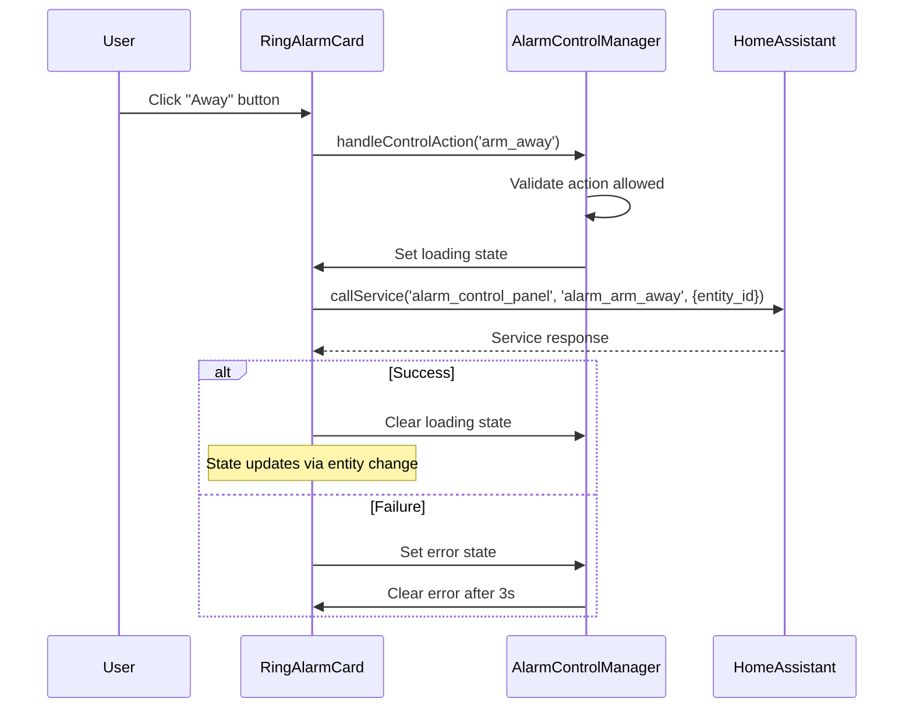

# Design Document: Alarm Control Buttons

## Overview

This design document describes the implementation of alarm control buttons for the Ring Alarm Card. The feature adds three action buttons (Disarmed, Home, Away) below the alarm status display, allowing users to change the alarm state directly from the card by calling Home Assistant alarm control panel services.

## Architecture

The alarm control buttons feature integrates with the existing Ring Alarm Card architecture:

```
┌─────────────────────────────────────────────────────────┐
│                    RingAlarmCard                        │
│  ┌───────────────────────────────────────────────────┐  │
│  │              Alarm Status Display                 │  │
│  │         (existing implementation)                 │  │
│  └───────────────────────────────────────────────────┘  │
│  ┌───────────────────────────────────────────────────┐  │
│  │              Control Buttons Row                  │  │
│  │  ┌─────────┐  ┌─────────┐  ┌─────────┐            │  │
│  │  │Disarmed │  │  Home   │  │  Away   │            │  │
│  │  └─────────┘  └─────────┘  └─────────┘            │  │
│  └───────────────────────────────────────────────────┘  │
└─────────────────────────────────────────────────────────┘
```

### Component Interaction Flow



## Components and Interfaces

### AlarmControlManager

A new utility class that handles alarm control logic, keeping the main card component focused on rendering.

```typescript
interface ControlAction {
  type: 'disarm' | 'arm_home' | 'arm_away';
  service: string;
  label: string;
}

interface ControlButtonState {
  isActive: boolean;
  isLoading: boolean;
  isDisabled: boolean;
  hasError: boolean;
}

class AlarmControlManager {
  /**
   * Get the list of available control actions
   */
  static getControlActions(): ControlAction[];

  /**
   * Determine which action corresponds to the current alarm state
   */
  static getActiveAction(alarmState: AlarmState['state']): ControlAction['type'] | null;

  /**
   * Check if control actions should be disabled based on alarm state
   */
  static areControlsDisabled(alarmState: AlarmState['state'] | undefined): boolean;

  /**
   * Get the Home Assistant service name for an action
   */
  static getServiceForAction(action: ControlAction['type']): string;

  /**
   * Map an action type to its display properties
   */
  static getActionDisplayProperties(action: ControlAction['type']): {
    label: string;
    icon: string;
    activeColor: string;
  };
}
```

### Button Rendering in AlarmDisplayRenderer

Extend the existing `AlarmDisplayRenderer` to include control button rendering:

```typescript
// Addition to AlarmDisplayRenderer
class AlarmDisplayRenderer {
  /**
   * Render the control buttons row
   */
  static renderControlButtons(
    alarmState: AlarmState | undefined,
    buttonStates: Map<ControlAction['type'], ControlButtonState>,
    onButtonClick: (action: ControlAction['type']) => void
  ): TemplateResult;

  /**
   * Render a single control button
   */
  static renderControlButton(
    action: ControlAction,
    state: ControlButtonState,
    onClick: () => void
  ): TemplateResult;
}
```

### RingAlarmCard Updates

The main card component will be updated to:

1. Add state for button loading/error states
2. Handle button click events
3. Call Home Assistant services
4. Render the control buttons section

```typescript
// New state properties in RingAlarmCard
@state() private buttonStates: Map<ControlAction['type'], ControlButtonState>;

// New methods
private async _handleControlButtonClick(action: ControlAction['type']): Promise<void>;
private _updateButtonState(action: ControlAction['type'], state: Partial<ControlButtonState>): void;
private _clearButtonError(action: ControlAction['type']): void;
```

## Data Models

### ControlAction Type

```typescript
type ControlActionType = 'disarm' | 'arm_home' | 'arm_away';

interface ControlAction {
  type: ControlActionType;
  service: string;      // e.g., 'alarm_disarm', 'alarm_arm_home', 'alarm_arm_away'
  label: string;        // e.g., 'Disarmed', 'Home', 'Away'
  icon: string;         // MDI icon name
  activeColor: string;  // CSS custom property for active state
}
```

### ControlButtonState Type

```typescript
interface ControlButtonState {
  isActive: boolean;    // Button corresponds to current alarm state
  isLoading: boolean;   // Service call in progress
  isDisabled: boolean;  // Button cannot be clicked
  hasError: boolean;    // Last service call failed
}
```

### Service Call Data

```typescript
interface AlarmServiceCallData {
  entity_id: string;
  code?: string;  // Optional: alarm code if required
}
```

## Correctness Properties

*A property is a characteristic or behavior that should hold true across all valid executions of a system—essentially, a formal statement about what the system should do. Properties serve as the bridge between human-readable specifications and machine-verifiable correctness guarantees.*

### Property 1: State-to-Active-Button Mapping

*For any* alarm state that corresponds to a control action (disarmed, armed_home, armed_away), the button matching that state SHALL be marked as active, and all other buttons SHALL be marked as inactive. The active button SHALL have the appropriate color class applied.

**Validates: Requirements 2.1, 2.2, 2.3, 6.2**

### Property 2: Transitional States Disable Controls

*For any* transitional alarm state (arming, disarming, pending, triggered), ALL control buttons SHALL be disabled. This ensures users cannot initiate new actions while the alarm is transitioning.

**Validates: Requirements 2.5**

### Property 3: Button-to-Service Mapping

*For any* control button click action, the correct Home Assistant service SHALL be called with the configured entity_id:
- "Disarmed" button → `alarm_control_panel.alarm_disarm`
- "Home" button → `alarm_control_panel.alarm_arm_home`
- "Away" button → `alarm_control_panel.alarm_arm_away`

**Validates: Requirements 3.1, 3.2, 3.3, 3.4**

### Property 4: ARIA Labels Present

*For any* control button rendered, it SHALL have an aria-label attribute that describes the action (e.g., "Set alarm to disarmed", "Arm alarm in home mode", "Arm alarm in away mode").

**Validates: Requirements 5.1**

### Property 5: ARIA Pressed Reflects Active State

*For any* control button, the aria-pressed attribute SHALL be "true" if and only if the button corresponds to the current alarm state.

**Validates: Requirements 5.4**

### Property 6: ARIA Disabled Reflects Disabled State

*For any* control button, the aria-disabled attribute SHALL be "true" if and only if the button is in a disabled state (due to transitional alarm state, missing HASS, or unavailable entity).

**Validates: Requirements 5.5**

## Error Handling

### Service Call Failures

When a Home Assistant service call fails:

1. The button that was clicked enters an error state (`hasError: true`)
2. The loading state is cleared (`isLoading: false`)
3. A visual error indicator is shown on the button (red border/background)
4. After 3 seconds, the error state is automatically cleared
5. The button returns to its normal state based on current alarm state

### Entity Unavailability

When the configured entity becomes unavailable:

1. All control buttons are disabled
2. The `areControlsDisabled` check returns `true`
3. Buttons show a disabled visual state
4. Click handlers are no-ops when disabled

### HASS Unavailability

When the HASS object is not available:

1. All control buttons are disabled
2. Service calls cannot be made
3. The card shows appropriate HASS status message

### Error State Recovery

```typescript
private _clearButtonError(action: ControlAction['type']): void {
  setTimeout(() => {
    this._updateButtonState(action, { hasError: false });
  }, 3000);
}
```

## Testing Strategy

### Unit Tests

Unit tests will cover specific examples and edge cases:

- Button rendering with different alarm states
- Service call invocation with correct parameters
- Error state handling and recovery
- Disabled state when entity/HASS unavailable
- Compact mode styling application

### Property-Based Tests

Property-based tests will verify universal properties using fast-check:

1. **State-to-Active-Button Mapping**: Generate random alarm states and verify correct button is active
2. **Transitional States Disable Controls**: Generate transitional states and verify all buttons disabled
3. **Button-to-Service Mapping**: Generate button actions and verify correct service called
4. **ARIA Labels Present**: Generate button configurations and verify aria-label exists
5. **ARIA Pressed Reflects Active State**: Generate states and verify aria-pressed matches
6. **ARIA Disabled Reflects Disabled State**: Generate disabled conditions and verify aria-disabled matches

### Test Configuration

- Minimum 100 iterations per property test
- Tests tagged with feature and property reference
- Format: `**Feature: alarm-control-buttons, Property N: [property description]**`

### Integration Tests

- Full card rendering with control buttons
- Button click triggering service calls
- State updates after service completion
- Theme change handling

