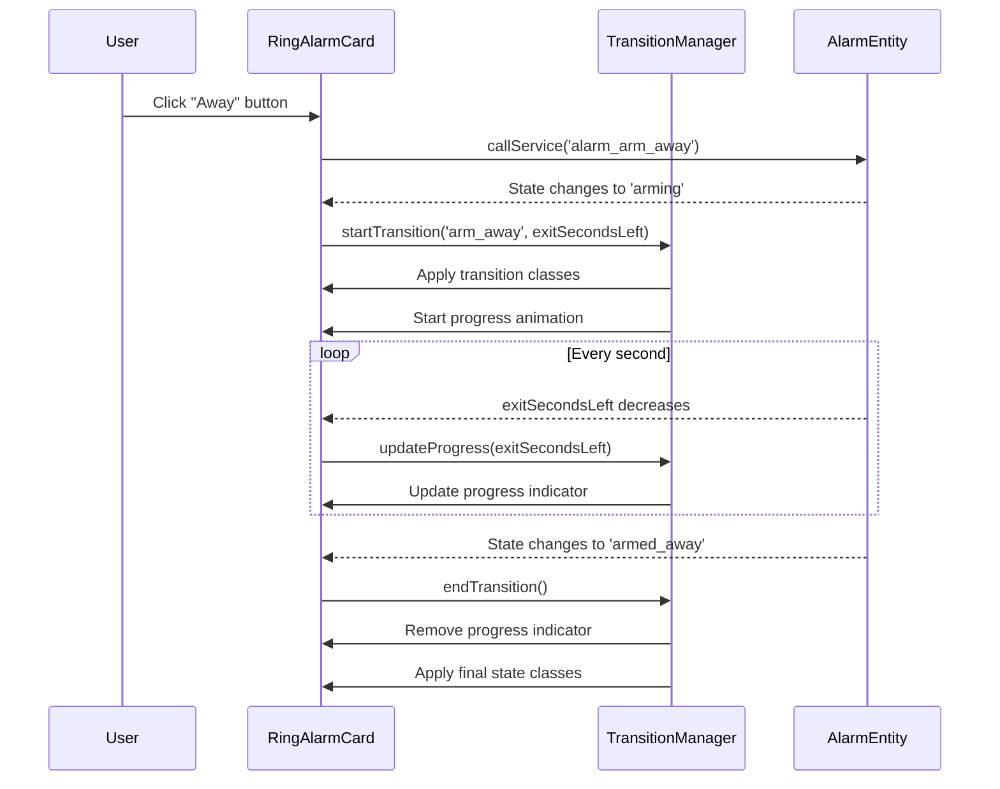

# Design Document: Alarm State Transitions

## Overview

This design document describes the implementation of visual state transitions and a progress indicator for the Ring Alarm Card control buttons. The feature enhances user feedback by animating transitions between alarm states and displaying a border-based progress indicator on the target button during alarm countdown periods.

The implementation extends the existing alarm control buttons feature by adding:
1. CSS-based transition animations for state changes
2. A border progress effect using CSS conic-gradient or border-image
3. Integration with the alarm entity's `exitSecondsLeft` attribute for timing
4. Accessibility features including ARIA labels and reduced motion support

## Architecture

The state transitions feature integrates with the existing Ring Alarm Card architecture:

```
┌─────────────────────────────────────────────────────────────────────┐
│                         RingAlarmCard                               │
│  ┌───────────────────────────────────────────────────────────────┐  │
│  │                    Alarm Status Display                       │  │
│  └───────────────────────────────────────────────────────────────┘  │
│  ┌───────────────────────────────────────────────────────────────┐  │
│  │                   Control Buttons Row                         │  │
│  │  ┌─────────────┐  ┌─────────────┐  ┌─────────────┐            │  │
│  │  │  Disarmed   │  │    Home     │  │    Away     │            │  │
│  │  │             │  │ ┌─────────┐ │  │             │            │  │
│  │  │             │  │ │Progress │ │  │             │            │  │
│  │  │             │  │ │ Border  │ │  │             │            │  │
│  │  │             │  │ └─────────┘ │  │             │            │  │
│  │  └─────────────┘  └─────────────┘  └─────────────┘            │  │
│  └───────────────────────────────────────────────────────────────┘  │
│  ┌───────────────────────────────────────────────────────────────┐  │
│  │              ARIA Live Region (screen reader)                 │  │
│  └───────────────────────────────────────────────────────────────┘  │
└─────────────────────────────────────────────────────────────────────┘
```

### Progress Indicator Technique

The progress indicator fills along the button's border edge, starting from the top center and progressing clockwise:

```
Button Border Progress Animation (clockwise from top):

    0%              25%             50%             75%             100%
  ┌─────┐         ┌██───┐         ┌█████┐         ┌█████┐         ┌█████┐
  │     │         │     │         │     █         █     █         █     █
  │     │         │     │         │     │         █     █         █     █
  └─────┘         └─────┘         └─────┘         └███──┘         └█████┘

  ─ │ = Normal button border (thin)
  █   = Progress indicator border (thicker, highlighted color)
  
  Progress path: top → right → bottom → left → back to top
```

The progress fills ONLY the border itself - the button interior remains unchanged. The effect is achieved using a pseudo-element with `conic-gradient` background, masked to show only the border area. The progress border is slightly thicker than the normal button border for visual prominence.

### State Transition Flow



## Components and Interfaces

### TransitionStateManager

A new utility class that manages state transition logic and progress calculations.

```typescript
interface TransitionState {
  isTransitioning: boolean;
  targetAction: ControlActionType | null;
  totalDuration: number;      // Total countdown in seconds
  remainingSeconds: number;   // Current exitSecondsLeft value
  progress: number;           // 0-100 percentage
}

class TransitionStateManager {
  /**
   * Determine if the alarm is in a transitional state
   */
  static isTransitionalState(alarmState: AlarmState['state']): boolean;

  /**
   * Get the target action for a transitional state
   * For 'arming' states, determines target based on entity attributes
   * For 'pending' states, returns the currently armed state
   */
  static getTransitionTarget(
    alarmState: AlarmState['state'],
    entityAttributes: Record<string, any>
  ): ControlActionType | null;

  /**
   * Calculate progress percentage from exitSecondsLeft
   * Returns 0-100 based on elapsed time vs total duration
   */
  static calculateProgress(
    exitSecondsLeft: number,
    totalDuration: number
  ): number;

  /**
   * Get the initial total duration when transition starts
   * Captures exitSecondsLeft at transition start
   */
  static captureInitialDuration(exitSecondsLeft: number): number;
}
```

### Button State Extensions

Extend the existing `ControlButtonState` interface:

```typescript
interface ExtendedButtonState extends ControlButtonState {
  isTransitionTarget: boolean;  // Button is the target of current transition
  transitionProgress: number;   // 0-100 progress percentage
}
```

### CSS Custom Properties for Progress

```typescript
// New CSS custom properties for progress indicator
interface ProgressCSSProperties {
  '--progress-percent': string;      // '0' to '100'
  '--progress-color': string;        // HA theme color
  '--progress-border-width': string; // Slightly thicker than button border
}
```

## Data Models

### TransitionState Type

```typescript
interface TransitionState {
  isTransitioning: boolean;
  targetAction: ControlActionType | null;
  totalDuration: number;
  remainingSeconds: number;
  progress: number;
  startTime: number;  // Timestamp when transition started
}
```

### Alarm Entity Attributes

The alarm_control_panel entity provides these relevant attributes:

```typescript
interface AlarmEntityAttributes {
  exitSecondsLeft?: number;  // Seconds remaining in countdown
  code_arm_required?: boolean;
  code_disarm_required?: boolean;
  // ... other attributes
}
```

## Correctness Properties

*A property is a characteristic or behavior that should hold true across all valid executions of a system—essentially, a formal statement about what the system should do. Properties serve as the bridge between human-readable specifications and machine-verifiable correctness guarantees.*


### Property 1: Transitional State Detection

*For any* alarm state, the `isTransitionalState()` function SHALL return `true` if and only if the state is one of: 'arming', 'pending', or 'disarming'. For all other states (disarmed, armed_home, armed_away, triggered, unknown), it SHALL return `false`.

**Validates: Requirements 2.1, 2.5**

### Property 2: Progress Indicator Presence

*For any* alarm state that is transitional (arming, pending, disarming), the target button SHALL have the progress indicator class applied. *For any* non-transitional state, no button SHALL have the progress indicator class.

**Validates: Requirements 2.1, 2.5**

### Property 3: Progress Calculation Accuracy

*For any* valid `exitSecondsLeft` value and `totalDuration`, the calculated progress SHALL equal `((totalDuration - exitSecondsLeft) / totalDuration) * 100`, clamped to the range [0, 100]. When `exitSecondsLeft` equals `totalDuration`, progress SHALL be 0. When `exitSecondsLeft` equals 0, progress SHALL be 100.

**Validates: Requirements 3.1, 3.2, 3.3**

### Property 4: Target Button Identification

*For any* transitional alarm state:
- When state is 'arming' with target 'home', the "Home" button SHALL be the transition target
- When state is 'arming' with target 'away', the "Away" button SHALL be the transition target  
- When state is 'pending' (entry delay), the currently armed button SHALL be the transition target

The transition target button SHALL be the only button displaying the progress indicator.

**Validates: Requirements 4.1, 4.2, 4.3, 4.4**

### Property 5: ARIA Label on Progress Indicator

*For any* button displaying a progress indicator, the button SHALL have an aria-label that includes the countdown status (e.g., "Arming in X seconds" or "X% complete").

**Validates: Requirements 5.1**

### Property 6: ARIA Live Region Updates

*For any* state change to a transitional state, the ARIA live region SHALL be updated with an announcement describing the state change (e.g., "Alarm arming to away mode").

**Validates: Requirements 5.2**

## Error Handling

### Missing exitSecondsLeft Attribute

When the alarm entity doesn't provide `exitSecondsLeft`:
1. The progress indicator still displays on the target button
2. Progress is shown as indeterminate (pulsing animation instead of progress)
3. The indicator is removed when the state changes to non-transitional

### Rapid State Changes

When multiple state changes occur rapidly:
1. Any in-progress animation is cancelled immediately
2. The new state is applied without waiting for previous animation
3. CSS transitions handle the visual smoothing automatically

### Entity Unavailability During Transition

If the entity becomes unavailable during a transition:
1. The progress indicator is removed
2. All buttons are disabled
3. The card shows the entity unavailable error state

## Testing Strategy

### Unit Tests

Unit tests will cover specific examples and edge cases:

- Progress calculation with various exitSecondsLeft values
- Target button identification for different transitional states
- ARIA label generation with countdown values
- CSS class application for transition states
- Reduced motion media query behavior

### Property-Based Tests

Property-based tests will verify universal properties using fast-check:

1. **Transitional State Detection**: Generate random alarm states and verify correct boolean result
2. **Progress Indicator Presence**: Generate states and verify indicator presence matches transitional status
3. **Progress Calculation Accuracy**: Generate random duration/remaining pairs and verify calculation
4. **Target Button Identification**: Generate transitional states with targets and verify correct button
5. **ARIA Label Presence**: Generate progress states and verify aria-label contains countdown info
6. **ARIA Live Region Updates**: Generate state transitions and verify announcements

### Test Configuration

- Minimum 100 iterations per property test
- Tests tagged with feature and property reference
- Format: `**Feature: alarm-state-transitions, Property N: [property description]**`

### Integration Tests

- Full card rendering with transitional states
- Progress animation during countdown
- State change handling and animation cancellation
- Theme change handling for progress indicator colors
- Reduced motion preference handling

## CSS Implementation Details

### Progress Border Effect

The progress indicator uses a pseudo-element with conic-gradient:

```css
.control-button.transitioning::before {
  content: '';
  position: absolute;
  inset: -2px; /* Slightly larger than button */
  border-radius: inherit;
  background: conic-gradient(
    from 0deg at 50% 50%,
    var(--progress-color) calc(var(--progress-percent) * 1%),
    transparent calc(var(--progress-percent) * 1%)
  );
  mask: 
    linear-gradient(#fff 0 0) content-box,
    linear-gradient(#fff 0 0);
  mask-composite: exclude;
  padding: 3px; /* Progress border thickness */
  pointer-events: none;
}
```

### State Transition Animation

```css
.control-button {
  transition: 
    background-color 300ms ease,
    border-color 300ms ease,
    color 300ms ease,
    box-shadow 300ms ease;
}

/* Reduced motion support */
@media (prefers-reduced-motion: reduce) {
  .control-button {
    transition: none;
  }
  
  .control-button.transitioning::before {
    animation: none;
    /* Show static progress instead */
  }
}
```

### Theme Integration

```css
.control-button.transitioning {
  --progress-color: var(--primary-color, #03a9f4);
}

.control-button.transitioning.arm_home {
  --progress-color: var(--warning-color, #ff9800);
}

.control-button.transitioning.arm_away {
  --progress-color: var(--error-color, #f44336);
}
```
