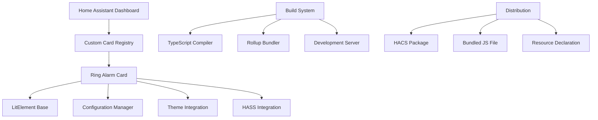

# Design Document: Ring Alarm Card Infrastructure

## Overview

This design outlines the infrastructure for a deployable custom Home Assistant Lovelace card built with the Lit framework and TypeScript. The card will serve as a foundation for future Ring alarm functionality, providing essential project structure, build system, configuration management, and basic card functionality.

The design follows modern web component standards using Lit 3.x, TypeScript for type safety, and Rollup for efficient bundling. The card will integrate seamlessly with Home Assistant's Lovelace dashboard system and be distributed through HACS (Home Assistant Community Store).

## Architecture

### Component Architecture



### Technology Stack

- **Frontend Framework**: Lit 3.x (LitElement)
- **Language**: TypeScript 5.x with strict mode
- **Build Tool**: Rollup with TypeScript plugin
- **Development Server**: Web Dev Server (@web/dev-server)
- **Code Quality**: ESLint + Prettier
- **Testing**: Jest with Lit testing utilities
- **Package Manager**: npm
- **Distribution**: HACS-compatible structure

## Components and Interfaces

### Core Card Component

```typescript
interface LovelaceCard extends HTMLElement {
  setConfig(config: CardConfig): void;
  set hass(hass: HomeAssistant): void;
  getCardSize?(): number | Promise<number>;
  getConfigElement?(): HTMLElement;
  getStubConfig?(): CardConfig;
}

interface CardConfig {
  type: string;
  title?: string;
  [key: string]: any;
}

interface HomeAssistant {
  states: { [entity_id: string]: HassEntity };
  callService(domain: string, service: string, data?: any): Promise<any>;
  // Additional HASS properties...
}
```

### Ring Alarm Card Implementation

```typescript
@customElement('ring-alarm-card')
export class RingAlarmCard extends LitElement implements LovelaceCard {
  @property({ attribute: false }) public hass!: HomeAssistant;
  @state() private config!: RingAlarmCardConfig;

  public setConfig(config: RingAlarmCardConfig): void;
  public getCardSize(): number;
  protected render(): TemplateResult;
  
  private _configChanged(config: RingAlarmCardConfig): void;
  private _validateConfig(config: RingAlarmCardConfig): void;
}

interface RingAlarmCardConfig extends CardConfig {
  type: 'custom:ring-alarm-card';
  title?: string;
}
```

### Configuration System

The card will implement a robust configuration system that validates YAML input and provides sensible defaults:

```typescript
class ConfigurationManager {
  static validateConfig(config: RingAlarmCardConfig): void {
    if (!config || typeof config !== 'object') {
      throw new Error('Invalid configuration object');
    }
    
    if (config.type !== 'custom:ring-alarm-card') {
      throw new Error('Invalid card type');
    }
  }
  
  static getDefaultConfig(): Partial<RingAlarmCardConfig> {
    return {
      title: 'Custom Card'
    };
  }
  
  static mergeConfig(config: RingAlarmCardConfig): RingAlarmCardConfig {
    return { ...this.getDefaultConfig(), ...config };
  }
}
```

## Data Models

### Card Configuration Model

```typescript
interface RingAlarmCardConfig extends LovelaceCardConfig {
  type: 'custom:ring-alarm-card';
  title?: string;
}

interface LovelaceCardConfig {
  type: string;
  [key: string]: any;
}
```

### Home Assistant Integration Models

```typescript
interface HassEntity {
  entity_id: string;
  state: string;
  attributes: { [key: string]: any };
  context: HassContext;
  last_changed: string;
  last_updated: string;
}

interface HassContext {
  id: string;
  parent_id?: string;
  user_id?: string;
}
```

Now I need to use the prework tool to analyze the acceptance criteria before writing the correctness properties.

<function_calls>
<invoke name="prework">
<parameter name="featureName">ring-alarm-card

## Correctness Properties

*A property is a characteristic or behavior that should hold true across all valid executions of a system—essentially, a formal statement about what the system should do. Properties serve as the bridge between human-readable specifications and machine-verifiable correctness guarantees.*

Based on the prework analysis, the following properties will validate the core functionality of the Ring alarm card infrastructure:

### Property 1: Configuration Validation and Storage
*For any* valid card configuration object, when passed to setConfig, the card should store the configuration and merge it with defaults appropriately
**Validates: Requirements 2.1, 2.3**

### Property 2: Invalid Configuration Rejection
*For any* invalid configuration object (missing type, wrong type, malformed structure), setConfig should throw a descriptive error
**Validates: Requirements 2.4, 2.5**

### Property 3: HASS Object Reactivity
*For any* valid HASS object, when assigned to the card's hass property, the card should handle the update without errors and trigger re-rendering
**Validates: Requirements 3.3**

## Error Handling

### Configuration Errors

The card implements comprehensive error handling for configuration issues:

```typescript
class ConfigurationError extends Error {
  constructor(message: string, public readonly configPath?: string) {
    super(message);
    this.name = 'ConfigurationError';
  }
}

// Usage in setConfig
public setConfig(config: RingAlarmCardConfig): void {
  try {
    ConfigurationManager.validateConfig(config);
    this.config = ConfigurationManager.mergeConfig(config);
  } catch (error) {
    throw new ConfigurationError(
      `Invalid card configuration: ${error.message}`,
      'setConfig'
    );
  }
}
```

### HASS Integration Errors

The card gracefully handles Home Assistant connection and state issues:

```typescript
protected updated(changedProps: PropertyValues): void {
  if (changedProps.has('hass')) {
    try {
      this._handleHassUpdate();
    } catch (error) {
      console.warn('Ring Alarm Card: HASS update error', error);
      this._showError('Connection to Home Assistant failed');
    }
  }
}
```

### Rendering Errors

The card provides fallback rendering for error states:

```typescript
protected render(): TemplateResult {
  if (this._error) {
    return html`
      <ha-card>
        <div class="error">
          <ha-icon icon="mdi:alert-circle"></ha-icon>
          <span>${this._error}</span>
        </div>
      </ha-card>
    `;
  }
  
  return this._renderCard();
}
```

## Testing Strategy

### Dual Testing Approach

The project will implement both unit testing and property-based testing to ensure comprehensive coverage:

**Unit Tests:**
- Verify specific examples and edge cases
- Test integration points between components
- Validate error conditions and boundary cases
- Focus on concrete scenarios and known inputs

**Property-Based Tests:**
- Verify universal properties across all inputs
- Test configuration handling with generated inputs
- Validate HASS object reactivity with random state changes
- Ensure comprehensive input coverage through randomization

### Property-Based Testing Configuration

The project will use **fast-check** as the property-based testing library for TypeScript/JavaScript. Each property test will:

- Run a minimum of 100 iterations per test
- Reference the corresponding design document property
- Use the tag format: **Feature: ring-alarm-card, Property {number}: {property_text}**

### Testing Framework Setup

**Jest Configuration:**
```javascript
// jest.config.js
module.exports = {
  preset: 'ts-jest',
  testEnvironment: 'jsdom',
  setupFilesAfterEnv: ['<rootDir>/src/test/setup.ts'],
  collectCoverageFrom: [
    'src/**/*.ts',
    '!src/**/*.d.ts',
    '!src/test/**/*'
  ],
  coverageThreshold: {
    global: {
      branches: 80,
      functions: 80,
      lines: 80,
      statements: 80
    }
  }
};
```

**Lit Testing Utilities:**
```typescript
import { fixture, html, expect } from '@open-wc/testing';
import { RingAlarmCard } from '../ring-alarm-card';

// Example unit test
describe('RingAlarmCard', () => {
  it('should render hello world message', async () => {
    const element = await fixture<RingAlarmCard>(
      html`<ring-alarm-card></ring-alarm-card>`
    );
    
    expect(element.shadowRoot?.textContent).to.include('Hello World');
  });
});
```

**Property-Based Test Example:**
```typescript
import fc from 'fast-check';

describe('Configuration Properties', () => {
  it('should handle valid configurations', () => {
    // Feature: ring-alarm-card, Property 1: Configuration Validation and Storage
    fc.assert(fc.property(
      fc.record({
        type: fc.constant('custom:ring-alarm-card'),
        title: fc.option(fc.string())
      }),
      (config) => {
        const card = new RingAlarmCard();
        expect(() => card.setConfig(config)).not.toThrow();
        expect(card.config).toEqual(expect.objectContaining(config));
      }
    ), { numRuns: 100 });
  });
});
```

### Build System Integration

The testing strategy integrates with the build system through npm scripts:

```json
{
  "scripts": {
    "test": "jest",
    "test:watch": "jest --watch",
    "test:coverage": "jest --coverage",
    "test:property": "jest --testNamePattern='Property'",
    "lint": "eslint src --ext .ts",
    "format": "prettier --write src/**/*.ts"
  }
}
```

This comprehensive testing approach ensures that both specific functionality and general correctness properties are validated, providing confidence in the card's reliability and maintainability.